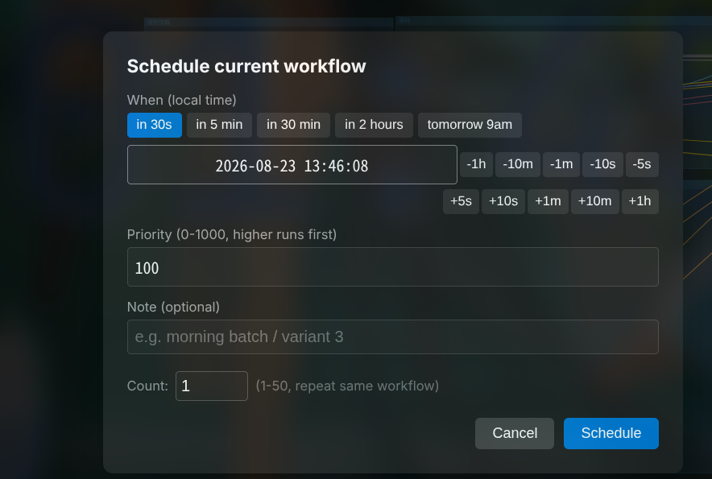
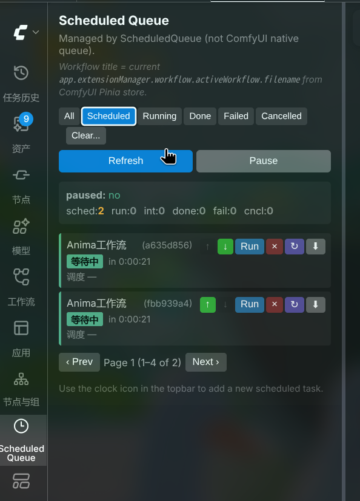
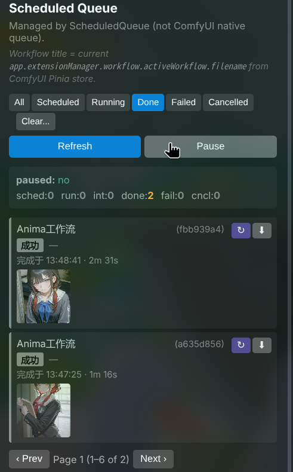

# ComfyUI-ScheduledQueue

**Status:** under development (v0.3.10). CLI and HTTP API are production-ready; the bundled sidebar UI is stable against ComfyUI ≥ 1.49.6.

[简体中文](README.zh.md)

---

## Overview

A ComfyUI queue extension that **persists every job to SQLite, supports pause/resume, drag-free reorder, and arbitrary-time delivery** — without disturbing ComfyUI's native Run button.

Submitting a workflow no longer means "seize the GPU right now". You can queue tonight's 23:00 batch render, tomorrow's 9:00 style experiment, and a seed resweep that's only useful a week from now — close the browser, reopen ComfyUI tomorrow, and the queue is already running.

> **Beta / public preview:** Please read [Compatibility](#compatibility) first. The bundled frontend assumes ComfyUI ≥ 1.49.6 with `app.registerExtension` and `app.extensionManager.registerSidebarTab`.

---

## Sidebar UI (main surface)

```
┌──────────────────────────────────────────────────────────────────────────┐
│ Scheduled Queue                                                          │
│ Managed by ScheduledQueue (not ComfyUI native queue).                    │
│ Workflow title = current app.extensionManager.workflow.activeWorkflow    │
│ .filename from ComfyUI Pinia store.                                      │
│                                                                          │
│ [All*] [Scheduled ] [Running ] [Done ] [Failed ] [Cancelled ]  Clear... │  ← ① status filter tabs
│ ┌────────────────────────────────────────────────────────────────────┐   │
│ │ [ ] Done (12)                                                      │   │  ② clear panel (collapsed by default;
│ │ [ ] Failed (3)                                                     │   │    Clear... button toggles it)
│ │ [ ] Cancelled (5)                                                  │   │
│ │ [ ] Running                                                        │   │
│ │ [ ] Scheduled                                                      │   │
│ │ [ ] Interrupted                                                    │   │
│ │             [ Clear selected ]                                     │   │
│ └────────────────────────────────────────────────────────────────────┘   │
│                                                                          │
│ [ Refresh ]   [ Pause ]                                                  │  ← ③ pause/resume button
│                                                                          │
│ ┌────────────────────────────────────────────────────────────────────┐   │
│ │ paused · scheduled=0  running=0  done=0  failed=0  cancelled=0    │   │  ④ live status bar
│ └────────────────────────────────────────────────────────────────────┘   │
│                                                                          │
│ ┌────────────────────────────────────────────────────────────────────┐   │
│ │ My morning batch (a1b2c3d4)                         [↑] [↓] [Run] │   │
│ │ [scheduled] in 9h 14m                                             │   │  ⑤ per-job row
│ │ scheduled 2026-08-23 22:30:00                                     │   │
│ │                                                  [↻ Repeat] [⬇]   │   │  ⑥ repeat / export buttons
│ ├────────────────────────────────────────────────────────────────────┤   │
│ │ Style variant 3 (9f8e7d6c)                       [× Cancel]      │   │
│ │ [running] running                                                  │   │
│ │ started 22:31:05 · 12.4s                                           │   │
│ ├────────────────────────────────────────────────────────────────────┤   │
│ │ Seed sweep pass 2 (5a4b3c2d)                       [↻ Repeat] [⬇] │   │
│ │ [done] done yesterday · 41.0s                                      │   │
│ │ [thumb 60x60] ← click to zoom                                      │   │  ⑦ 60x60 thumbnail for done jobs
│ └────────────────────────────────────────────────────────────────────┘   │
│                                                                          │
│ [ ‹ Prev ]  Page 1 (1–3 of 17)  [ Next › ]                              │  ← ⑧ pagination
│                                                                          │
│ Use the clock icon in the topbar to add a new scheduled task.           │
└──────────────────────────────────────────────────────────────────────────┘
```

**Sidebar UI element map:**

| # | Element | Code reference |
|---|---------|----------------|
| ① | Status filter tabs (All / Scheduled / Running / Done / Failed / Cancelled) | `data-filter` row, `sidebar_tab.js` L57–L63 |
| ② | Clear panel — checkbox list + per-status live counts | `[data-role="clear-panel"]` L66–L73 |
| ③ | Pause/Resume button (toggles text + green/grey background) | `[data-act="pause-resume"]` L78, handler L706–L716 |
| ④ | Live status bar (paused flag + per-status counts) | `[data-role="status"]` L81 |
| ⑤ | Job row: `workflow_title` (+ short id suffix), status badge, time | L523–L549 |
| ⑥ | Repeat / Export per-row buttons | `↻` POST `/repeat/{id}`, `⬇` GET `/export/{id}` |
| ⑦ | 60×60 thumbnail (done jobs only); click → fullscreen modal | L570–L582, modal L575–L577 |
| ⑧ | Pagination (Prev / Page info / Next) | `[data-role="pager"]` L86–L89 |

The topbar **Schedule** button (clock icon, left of Run) opens a modal for adding new tasks — see [docs/USER_GUIDE.md §3](docs/USER_GUIDE.md#3-添加单个任务--schedule-对话框) (USER_GUIDE.md is currently Chinese-only).

### Real UI screenshots


*ComfyUI topbar clock-icon plugin submit button*


*Schedule dialog: three-segment time controls + Priority + Note + Count*


*Scheduled tab: queued tasks + reorder buttons + pagination*


*Done tab: completion time + duration + preview thumbnails*

---

## Features

| Pain point | Solution | Where |
|---|---|---|
| I want the prompt to run when the GPU is idle but I don't want to leave my computer on at night | **Time-window scheduling** — any ISO or relative time (`--in 10m`, `--in 2h`, `tomorrow 9 am`) | `scheduler.tick()` → `claim_next_due_job()` |
| ComfyUI crashes / restarts lose the in-memory queue | **Persistence** — every job lands in `<ComfyUI>/user/scheduled_queue.sqlite3` (WAL mode) | `database.py` `ScheduledQueueDB` |
| I want a batch of 50 but I don't want to click Run 50 times | **Repeat (Clear / Repeat / Batch add)** — `Count: N` submits 1–50 copies at once; the Repeat (↻) button clones a finished job in one click | `/api/schedule/add-batch`, Repeat button L542 |
| 30 items in the queue, all I see is `KSampler-42`, I can't tell which one is from which batch | **Workflow naming (`workflow_title` from Pinia store)** — read at submit time from `app.extensionManager.workflow.activeWorkflow.filename`, persisted to the DB, shown in priority in the sidebar | `add` route L249, sidebar L561–L567 |
| I can't find the image from my last run among the completed jobs | **Preview thumbnail (60×60)** — `done` jobs auto-fetch a thumbnail; click to enlarge | `get_job_with_outputs()` L246 → sidebar thumb L570–L582 |
| The same workflow runs 5 times, all are cache hits, all the same image | **Cache-reuse prevention (hook defaults to `randomize`)** — at dispatch, read `control_after_generate` (`fixed` / `randomize` / `increment` / `decrement`) and rewrite `seed` / `noise_seed`; also convert UI format → API format so the hook actually sees the seed | `scheduler.py` `_apply_pre_dispatch_hooks`, `workflow_format.py` |
| I want a batch to run tonight but I also want to slot in an immediate manual job right now | **Pause / resume** — one HTTP call stops dispatching; in-flight prompts are not interrupted (we can't reach ComfyUI's worker) | `/pause-all`, `/resume-all` |

---

## Installation

Full steps in [docs/INSTALL.md](docs/INSTALL.md). Quick path:

```bash
git clone https://github.com/27-exe/ComfyUI-ScheduledQueue
cd ComfyUI-ScheduledQueue
ln -s "$(pwd)/src/comfyui_scheduled_queue" "$COMFYUI/custom_nodes/ComfyUI-ScheduledQueue"
ln -s "$(pwd)/scripts/comfy-schedule"       "$HOME/.local/bin/comfy-schedule"
"$VENV_PYTHON" main.py     # start ComfyUI
# expect: [ScheduledQueue] Stage 3 initialised. db=...
comfy-schedule resume     # default is paused on first boot
```

## Quick start

```bash
# add a job in 10 minutes
echo '{"3": {"class_type": "KSampler", "inputs": {"seed": 42}}}' \
  | comfy-schedule add - --in 10m --note "morning batch"

# add 5 copies of the same workflow (count 5 → /add-batch)
cat workflow.json | comfy-schedule add - --in 1h --priority 200

# watch the queue
comfy-schedule watch --interval 2

# cancel / run-now
comfy-schedule cancel <job_id>
comfy-schedule run-now <job_id>
```

In the UI: click the **clock icon** in the topbar → choose a preset → **Schedule**.

---

## Compatibility

| ComfyUI | Frontend | Status |
|---|---|---|
| 0.33.0 + 1.49.6 frontend | 1.49.6 | ✅ supported (developed here) |
| 0.33.0 + 1.48.x frontend | < 1.33.9 | ❌ frontend sidebar not registered |
| master (≥ v0.34) | ≥ 1.49.x | likely OK; run the test suite |

Backend requires **Python ≥ 3.10**. There are **no third-party Python dependencies** (uses `urllib.request` from stdlib).

## Running the test suite

```bash
python -m unittest discover tests -v
```

Currently **133 / 133 pass** (no `aiohttp` / no running ComfyUI required).

> Note: this repo currently runs 207 tests on Python 3.14. The 33 errors under `test_routes.TestRoutes` / `TestWorkflowTitleRoutes` are pre-existing `asyncio.get_event_loop()` deprecation failures, not regressions from this README split.

---

## Documentation

- [docs/INSTALL.md](docs/INSTALL.md) — install / upgrade / rollback / compatibility matrix / smoke test
- [docs/ARCHITECTURE.md](docs/ARCHITECTURE.md) — process model, state machine, design decisions
- [docs/USER_GUIDE.md](docs/USER_GUIDE.md) — Chinese user guide with sidebar / schedule-dialog screenshots
- [CHANGELOG.md](CHANGELOG.md) — full version history

---

## Security

- **No payload over the wire from `/list`** — list endpoints strip `payload` so workflow JSON is never echoed back.
- **Whitelist-only updates** — `/update` rejects any field outside `{scheduled_at, priority, note, auto_retry, workflow_title}`.
- **Cancel only touches pending rows** — running jobs are not silently removed.
- **No shell hooks** — the scheduler uses `urllib.request`, not `subprocess`.

## Limitations (read before filing a bug)

- **Cancel ≠ ComfyUI native interrupt.** A row with status `running` cannot be recalled once ComfyUI's worker thread has started; we mark our copy as `cancelled` but ComfyUI will still finish the actual prompt.
- **Reconciliation latency** is bounded by `RECONCILE_INTERVAL = 5 s`. A 1 s job may stay `running` for ~5–9 s before flipping to `done`.
- **No WebSocket subscription.** The reconciliation loop is HTTP only.
- **`workflow_title` reads `"Unsaved Workflow"`** until you Save As… the workflow in ComfyUI (matches ComfyUI's own display).
- **Frontend assumes v1.49.6+.** Older legacy queue menu is not addressed.

---

## License

MIT — see [LICENSE](LICENSE).

## Contributing

Issues and PRs welcome at https://github.com/27-exe/ComfyUI-ScheduledQueue/issues.

When reporting a bug, include:
1. `comfy-schedule status` output
2. The relevant `comfyui.log` line(s) with `[ScheduledQueue]` prefix
3. Which side of the scheduler was active: CLI / HTTP / Sidebar / Schedule dialog
